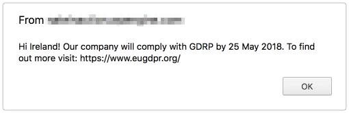

# GeoTarget JS Example

This plugin is an example of how to pass WP Engine GeoTarget data to javascript. This example displays a message to any visitors from EU countries alerting them to upcoming GDRP compliance changes.

**How to test:**

With the plugin installed, just add a query string in the URL for an EU member country: `?geoip&country=IE`

You will see something like this:

